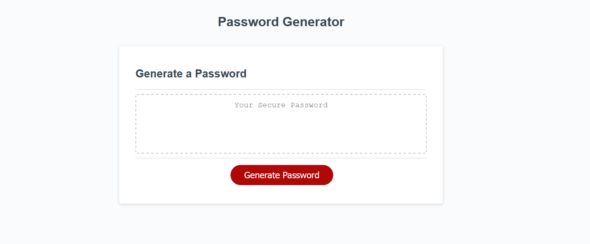

# msubc-challenge-3 | [Password Generator](https://anjato.github.io/msubc-challenge-3/)
This web application simply generates a password dictated by user input on four prompts confirming the use of lowercase and uppercase letters, numerical values, and special characters.

